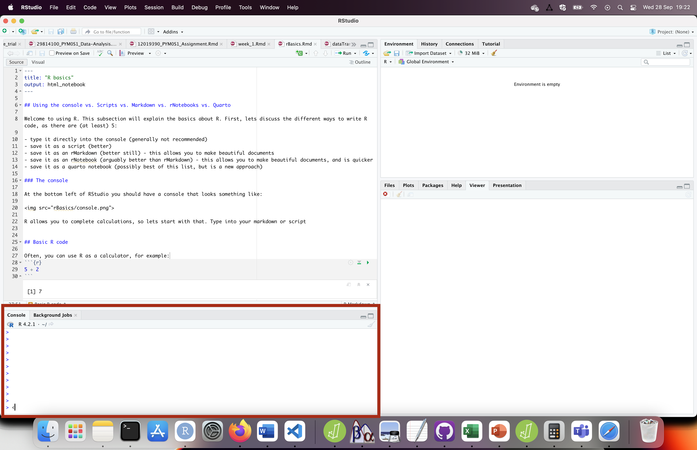

## Using the console vs. Scripts vs. Markdown vs. rNotebooks vs. Quarto

Welcome to using R. This subsection will explain the basics about R. First, lets discuss the different ways to write R code, as there are (at least) 5:

- type it directly into the console (generally not recommended)
- save it as a script (better)
- save it as an rMarkdown (better still) - this allows you to make beautiful documents
- save it as an rNotebook (arguably better than rMarkdown) - this allows you to make beautiful documents, and is quicker
- save it as a quarto notebook (possibly best of this list, but is a new approach)

### The console

At the bottom left of RStudio you should have a console that looks something like what's highlighted in <span style="color:red">red</span> below:



You can type straight into the console, to get a result


## Basic R code

R allows you to complete calculations, so lets start with that. Type into your markdown or script


Often, you can use R as a calculator, for example:
```{r}
5 + 2
```


It's helpful to store these calculations into **objects**:
```{r}
a = 5 + 2
a # to show what a is equal to
```