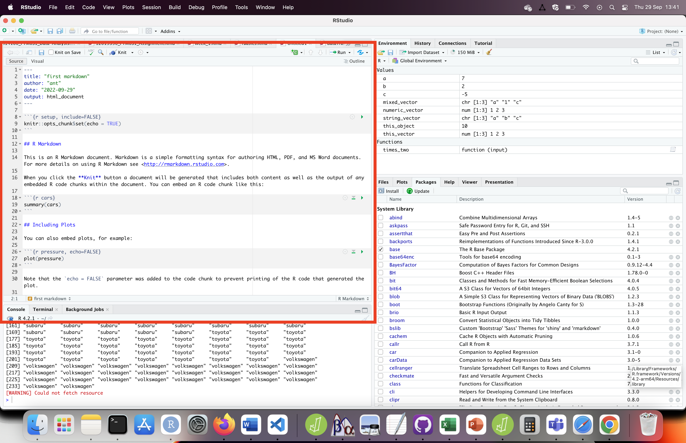

## Using the console vs. Scripts vs. Markdown vs. R Notebooks

Welcome to using R. This subsection will explain the basics about R. First, lets discuss the different ways to write R code, as there are (at least) 5:

- type it directly into the console (generally not recommended)
- save it as a script (better) ***note that script can refer to any of the below, but in this case is being used to describe a script that doesn't generate a notebook***
- save it as an R Markdown (better still) - this allows you to make beautiful documents
- save it as an R Notebook (arguably better than R Markdown) - this allows you to make beautiful documents, and is quicker


### The Console

At the bottom left of RStudio you should have a console that looks something like what's highlighted in <span style="color:red">red</span> below:


You can type straight into the console, to get a result. You can scroll through your previous commands by pressing the up arrow in the console. Each time code is run in the console it updates the environment in the top right of R-Studio:


### Scripts

The word "script" can be interpreted specifically, to refer to a type of R file that includes a lot of code, or generally to refer to any file that includes both R code and code that allows you make a nice looking report. In this subsection, we will be focusing on "script" as a particular type of file. To create a script, click on **File -> New File -> R Script**


You will then be shown a blank script, in which you can write a series of functions, and then run them. To run the lines of code, select a line, and then press CTRL-ENTER, or highlight a chunk of code and then press CTRL-ENTER. In either case, the code will be sent to the console and run there. 

An advantage of a script over just using the console is that you can analyse your data in both *structured and complex ways* which is difficult if you are typing code directly into the console.

### R Markdown

As highlighted above, R Markdown is a type of "script" in the general sense of the word, but allows you to create beautiful .html notebooks (.html files are what internet pages are based on). You are in fact reading an example of what can be produced by R Markdown (and R Notebooks). To make an R Markdown file, click on **File -> New File -> R Markdown**. You will be asked for a title, author and what output you would like. I would suggest "first markdown", your name and "html" as the respective answers. You should then see something like:



**The following points apply to both R Markdown and R Notebooks**

If you look above, you may notice that there are 2 types of code: Markdown (to write a nice looking report) and R (in grey chunks). I think these are well explained here: https://www.rstudio.com/wp-content/uploads/2015/02/rmarkdown-cheatsheet.pdf so I'll just explain that R Markdowns run all the code in the chunks each time they generate the output file (e.g. html file). This is important to know, because R Notebooks do **not** do this.

### R Notebooks

R Notebooks can be created by clicking on **File -> New File -> R Notebook**. They look quite similar to R Markdowns, but automatically generate the .html output **each time you save the notebook**. The output file will be a **.nb.html** file in the same folder as your notebook. 

***Very importantly*** - the *.nb.html* file will be built based on what happened the last time you run each R chunk. If you never ran the R Chunk, then the nb.html file will not use the output from that chunk. **This makes R Notebooks quicker than R Markdowns, because you don't have to generate the output from scratch each time, but there is a risk of you forgetting to run a chunk after changing it**.

## Fundamental's of R

R allows you to complete calculations, so lets start with that. Type into your markdown or script

Often, you can use R as a calculator, for example:
```{r}
5 + 2
```

It's helpful to store these calculations into **objects**:
```{r}
a <- 5 + 2  # this is exactly the same as writing a = 5 + 2, but <- is encouraged in R to avoid confusion with other uses of = (e.g. == operator when you are comparing if two values are identical)
# this # is starting a comment, code that will be ignored but allows you to annotate your work
a # to show what the value 7 is now stored in the object "a"
```


This means that you can compare objects to each other later

```{r}
b <- 2
b - a
c <- b-a
c # to show what c is
```

Some advice/rules for **Objects**:

- You cannot have a space in an object name. "my object" would be an invalid object name.
- object names are ***case-sensitive***, so if your object is called "MyObject" you cannot refer to it as "myobject".
- "." and "_" are acceptable characters in variable names.
- you can overwrite objects in the same way that you define an object

```{r}
this_object <- 5
this_object # to show what the object value is
this_object <- 10 # overwrites this_object
this_object # should now show 10
```

- be careful to not give an object the same name as a function! This will overwrite the function. To check if the name already exists, you can start typing it and press tab. So typing "t.te" and pressing the tab will give you "t.test"


### Functions

In a variety of coding languages like R, **functions** are lines of code you can apply each time you call the function, and apply it to **input** to get an **output**. If you wanted to make a function that multiplied numbers by 2, it would look something like:

```{r}
times_two <- function(input){  # Define your function by stating it's name, and then using <- to describe it
  output = input * 2           # creates an output object that is the input object (see line above) x 2
  return (output)              # gives the output back to the user when they run the function
}
times_two(4)                   # should give you 8
```

The **great news** is that you don't need to write functions 99% of the time in R, there are a wide variety of functions that are available. Some of which will be used in the next section.

### Types of Objects

#### Vectors

**Vectors** store a series of values. Often these will be a series of numbers:

```{r}
numeric_vector = c(1,2,3)
numeric_vector
```

The "c" above is short for "combine" as you're combining values together to make this vector. 
**Strings** are values that have characters (also known as letters) in them. Lets see if we can make a vector of **strings**:

```{r}
string_vector = c("a", "b", "c")
string_vector
```

Looks like we can. But what happens if you mix strings and numbers in a **vector**:

```{r}
mixed_vector = c("a", 1, "c")
mixed_vector
```

R seems to be happy to put them into a single vector. But there are different types of values and vectors, so lets ask R what each type of (using the "typeof" **function**) vectors we have above:

```{r}
typeof(numeric_vector)
typeof(string_vector)
typeof(mixed_vector)
```

The numeric vector is a "double" vector. **Double** refers to the fact that the numbers *can include decimals*, as opposed to **integer** numbers *which have to be whole numbers*. Interestingly, R has assumed the list of numbers should be **double** rather than **integer**, which seems like the more robust thing to do, as integer numbers can always be double, but double numbers can't always be integers.

#### Data frames

**Data frames** look like tables, in which you have a series of columns with **headers** that describe each column. 

Some data frames are already loaded into RStudio when you run it, such as the "mpg" dataframe. To look at it, just type in it's name:

```{r}
mpg
```

*Note that you may see 2 tables above, but they should be identical if so*

The **mpg** dataframe has information about a variety of cars, their manufacturers, models, as described https://ggplot2.tidyverse.org/reference/mpg.html. You will need to refer to data frames and their columns, the convention for this being to write data frame$column. Lets do this to see what's in the "manufacturer" column:

```{r}
mpg$manufacturer
```


### Packages

Whilst a lot of the functions you will need are in the *base* code that is active by default, you will at times need extra packages of code to do more powerful things. A commonly used package is ggplot2 [https://ggplot2.tidyverse.org/], which allows you to make ***beautiful*** figures in R. To use ggplot2 use need to **install** it and then load it from the **library**

```{r}
if(!require(ggplot2)){install.packages("ggplot2")}
library(ggplot2)
```

Now that you have a package for making beautiful plots, less learn about "intelligent copy and paste" to make use of it.

### Intelligent copy and paste

People experienced with coding ***do not write all their code from memory***. They often copy and paste code from the internet and/or from their old scripts. So, assuming you've installed and loaded ggplot2 as described above, lets copy and paste code from their website (as of September 2022; https://ggplot2.tidyverse.org/)

```{r}
ggplot(mpg, aes(displ, hwy, colour = class)) + 
  geom_point()
```
Good news is that we have a nice looking figure. But now we need to work out how to understand the code we've copied so that you can apply it to your own scripts. There's a lot to unpack, so making the code more **vertical** can help you break it down and comment it out. Using the below and a description of the mpg dataframe (https://ggplot2.tidyverse.org/reference/mpg.html), can you comment it out

```{r}
ggplot(
  mpg,              #
  aes(              #
    displ,          #
    hwy,            #
    colour = class  #
  )
) + 
geom_point()        #
```
Here's how I would comment it out:

```{r}
ggplot(
  mpg,              # dataframe
  aes(              # aesthetic properties
    displ,          # x-axis
    hwy,            # y-axis
    colour = class  # which column I will base the color on (often "color" is safer spelling in code)
  )
) + 
geom_point()        # what I would like drawn on
```

Now to understand the above code, try running it after changing lines. For example, what happens if you change the x-axis:

```{r}
ggplot(
  mpg,              # dataframe
  aes(              # aesthetic properties
    cty,            # x-axis - updated
    hwy,            # y-axis
    colour = class  # which column I will base the color on (often "color" is safer spelling in code)
  )
) + 
geom_point()        # what I would like drawn on

```
To make beautiful figures in R, you can largely google the type of plot you want, copy the example code that the website has, and then swap in the relevant features for your plot. This principle of copying and pasting code, (making it vertical to make it legible is not necessary, but can be helpful), and then editing it to work for your own script is an **essential skill** to speed up your coding.